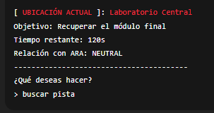
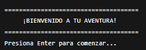

[](https://classroom.github.com/a/mi1WNrHU)
# Proyecto de C++ - [ECOS]

## Descripción del Proyecto

La historia, titulada "ECOS", es una aventura de ciencia ficción y misterio con una duración estimada de 15 minutos de juego o narración. Despiertas en KALYX-9, una estación subterránea en caos. Alarmas, luces rojas y una advertencia: el reactor explotará en 15 minutos. No recuerdas nada. Saliste de una cámara criogénica rota, rodeado de sangre y signos de pelea. Algo salió muy mal… y apenas estás empezando.

## Tematica y ambientación
Ecos es una historia interactiva acerca de la identidad y la conciencia de uno mismo, así como de las
implicaciones éticas de la tecnología: la aventura. Situado en un mundo claustrofóbico y un futuro
distópico y las máquinas de un desastre venidero que se encuentra a la vuelta de la
esquina, es oscuro y reflexivo y encantadoramente enigmático con ese toque futurista.

En general, la jugabilidad se basa en la premisa de que el jugador se despierta repentinamente sin
recuerdo y, por lo tanto, tiene que actuar rápidamente en un entorno que frecuentemente se derrumba
con rapidez. Los momentos en los que se revela el enigma entretejido del pasado y el presente se
entrelazan con el tiempo dedicado a explorar y tomar decisiones. La IA de ARA es tanto una abrumadora
guía a seguir como un enigma: a veces ARA es precisa y útil, y a veces miente o lleva mal al jugador,
planteando la cuestión de quién es y cuáles son sus intenciones

## Aplicación de los temas vistos

### 1. *Estructuras
Se usaron para definir entidades o caracteristicas dentro del juego:
struct player 
    int time;
    string currentLocation;
    string currentgoal;
    vector<string> memoriesFound;
    string araState;
    bool finalModuleFound;

### 2. *Vectores
Para almacenar listas dinámicas como ubicaciones, acciones y memorias:
vector<location> locations;
vector<action> actions;

### 3. **Funciones
Cada parte del juego esta modularizado por medio de funciones para facilitar su realizacion:
void playGame();
void show_Scene(player& player, const vector<location>& locations);

### 4. **Condicionales y bucles
Se usan para controlar el flujo de decisiones y final del juego:

while (player.time > 0 && !player.finalModuleFound) 
    string entrada = handle_Entry();
    process_Action(entrada, player, actions, locations)

### 5. **Lectura desde los archivos
Se lee informacion que se encuentra en archivos .txt para cargar ubicaciones y acciones que el jugador realiza:

ifstream file("locations.txt");
ifstream file("actions.txt");

## Consideraciones Tecnicas
Lenguaje: C++
Compilador: g++
Arquitectura: Basado en consola y no posee uso de graficos
Modularizacion: La separacion de archivos .h y .cpp para que el codigo presentara una mejor organizacion
Plataforma compatible: Windows, Linux y Mac( necesita ajustes para el clearConsole() )

## Imagenes del juego
Imagenes preliminares del juego



## Equipo

- **Nombre del equipo:** RAMones

### Integrantes del equipo

1. **Nombre completo:** [Alejandro Jose Ayala Pleitez]
   **Carnet:** [00237625]

2. **Nombre completo:** [Julio Ernesto Alvarez Parada]  
   **Carnet:** [00245425]

3. **Nombre completo:** [Wilmer Daniel Cabezas Bellozo]  
   **Carnet:** [00024625]


## Instrucciones de Ejecución

1. Clona este repositorio en tu máquina local:
   ```bash
   git clone [https://github.com/FDP-01-2025/project-ramones]
